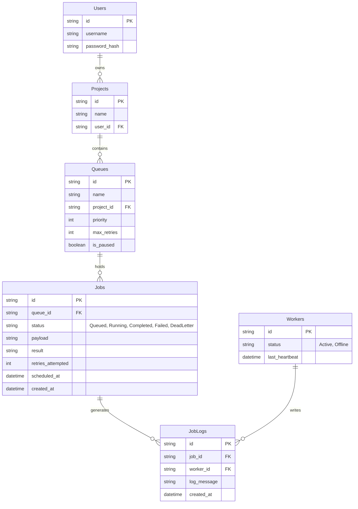

# Entity Relationship Diagram

### Table Details
- **Users**: Minimal authentication table.
- **Projects & Queues**: Used for logical separation of jobs.
- **Jobs**: The core table. `status` tracks the lifecycle. `scheduled_at` handles delayed/scheduled jobs.
- **Workers**: Tracks active worker processes via heartbeats to detect zombie workers.
- **JobLogs**: Stores execution history and errors for debugging.
