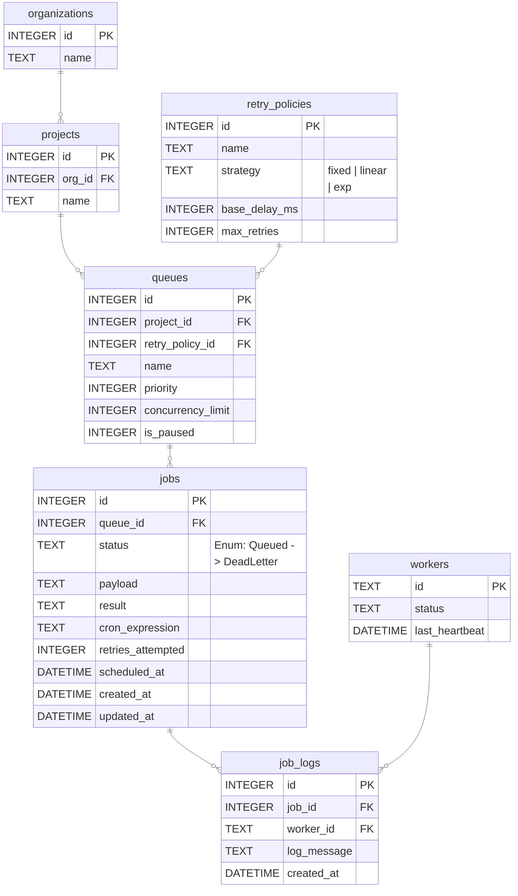

# Database Entity Relationship Diagram

This diagram outlines the relational schema for the Distributed Job Scheduler, completely satisfying the requirements for Organizations, Projects, Queues, Jobs, Retry Policies, and logging.

## Indexes & Performance Considerations
- `idx_jobs_status_scheduled`: Index on `jobs(status, scheduled_at)` to heavily optimize the worker's polling query, avoiding full table scans.
- `idx_jobs_queue`: Index on `jobs(queue_id)` for faster queue statistics.
- `idx_job_logs_job_id`: Index on `job_logs(job_id)` for quick retrieval of execution logs per job.

## Cascading Behavior
- When an Organization is deleted, its Projects are deleted (`ON DELETE CASCADE`).
- When a Project is deleted, its Queues are deleted (`ON DELETE CASCADE`).
- When a Queue is deleted, its Jobs are deleted (`ON DELETE CASCADE`).
- When a Job is deleted, its execution logs are deleted (`ON DELETE CASCADE`).
